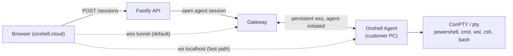

# Onshell Agent

A small program the customer installs on **their own computer**, so a browser tab on
onshell.cloud can open that machine's PowerShell, cmd, WSL, zsh, or bash — and browse
its files — without that machine running an SSH server.

## Why an agent exists at all

A browser cannot spawn a process on the machine it runs on. There is no API for it and
there never will be one: it is the sandbox boundary the whole web security model rests
on. Every product in this category (TeamViewer, VS Code Tunnels, Cloudflare WARP,
JetBrains Gateway) resolves it the same way — a local program the user installs
deliberately, which then does what the browser cannot.

So the agent is not an implementation shortcut. It *is* the feature.

## What this is not

`transport: "local"` already exists in [protocols/local.ts](../apps/gateway/src/protocols/local.ts).
That is the shell on the **gateway's own machine** — the built-in
`Onshell server (local shell)` host from [lib/provisioning.ts](../apps/api/src/lib/provisioning.ts).
It is unrelated to this document. The agent adds a third transport, `"agent"`, which
reaches a *customer's* machine.

Nor is this FTP. The customer-facing word can stay "file access", but the wire protocol
is not FTP:

* FTP needs an inbound listening port on the customer's PC — dead on arrival behind
  home NAT, corporate firewalls, and CGNAT.
* FTP is plaintext, and FTPS/SFTP would mean shipping a full server in the agent.
* Browsers dropped FTP entirely (Chrome 88–95 removed it), so the browser could not
  speak it regardless.

Instead the agent answers `fs.*` RPCs over the same connection the terminal uses, and
the gateway exposes them as a `FileTransport`. The existing file-manager UI and every
route in [routes.ts](../apps/gateway/src/routes.ts) then work unchanged.

## Topology



Two paths, one agent:

**Tunnel (default).** The agent dials *out* to `onshell.cloud/gateway` and holds the
connection open. Works behind any NAT or firewall that allows outbound HTTPS, which is
all of them. Lets a phone in another country reach a desktop at home. Every byte is
attributable in the audit log.

**Localhost (fast path).** When the browser happens to be on the same machine as the
agent, it connects straight to `127.0.0.1` — no round trip to our infrastructure, no
bandwidth cost, no added latency. Selected automatically when available, with the tunnel
as fallback. See [Localhost fast path](#localhost-fast-path) for the browser caveats
that make this a fallback-capable optimisation rather than the primary design.

## Enrollment

A device is paired once. The pairing code is the only moment a human transcribes a
secret, so it is short-lived and single-use.

1. Browser: **Connect this computer** → `POST /agents/pairing-codes`.
   API returns an 8-character code (`K7QP-2M4X`), TTL 10 minutes, shown once and never
   retrievable. Rate-limited per user and per organization.
2. User runs `onshell-agent pair K7QP-2M4X` (the installer prompts for it on the last
   screen, so most users never see a terminal).
3. Agent → `POST /agents/enroll` with the code plus `{ machineName, platform, arch,
   osVersion, agentVersion, fingerprint }`.
4. API validates the code, consumes it, creates an `AgentDevice` row **and** a `Host`
   row for it, and returns `{ deviceId, deviceToken }`.
5. Agent stores `deviceToken` in the OS credential store — DPAPI/Credential Manager on
   Windows, Keychain on macOS, libsecret on Linux with a `0600` file fallback. The
   server keeps only an Argon2id hash of it.

`fingerprint` is a stable machine identifier (machine GUID / IOPlatformUUID /
`/etc/machine-id`) used to detect a device re-enrolling after a reinstall, so the host
list does not accumulate duplicates. It is not a security boundary — it is spoofable and
is never trusted for authentication.

### Why the gateway never sees the device token

The gateway has no database and no notion of users; that is deliberate and worth
keeping. So the agent authenticates against the **API**, not the gateway:

```
Agent --deviceToken--> API  /agents/token   -->  short-lived agent JWT (15 min)
Agent --agent JWT-->   GW   wss://.../agent -->  signature-checked, no DB lookup
```

The gateway validates the JWT signature with the shared secret it already holds and
reads `deviceId` and `organizationId` from the claims. Revocation is therefore bounded
by the JWT lifetime for an *already-open* connection — so revocation also pushes an
explicit `kill` down the tunnel rather than waiting for expiry. See
[Revocation](#revocation).

## Wire protocol

One WebSocket per agent carries every terminal and every file operation, so frames are
multiplexed by channel.

**Text frames are JSON control messages. Binary frames are pty bytes**, prefixed with a
`uint32` little-endian channel id. That split means the hot path (keystrokes and screen
output) never pays for JSON encoding or base64, while everything else stays readable in
a packet capture.

### Control frames

| Direction | Frame | Meaning |
| --- | --- | --- |
| agent → gw | `{t:"hello", agentVersion, platform, arch, shells:[…]}` | first frame after connect; advertises available shells |
| gw → agent | `{t:"open-shell", ch, shell, cols, rows, cwd?}` | start a pty on channel `ch` |
| agent → gw | `{t:"opened", ch, pid}` | pty is live |
| gw → agent | `{t:"resize", ch, cols, rows}` | window change |
| gw → agent | `{t:"close", ch}` | terminate the pty |
| agent → gw | `{t:"exit", ch, code}` | pty ended |
| gw ↔ agent | `{t:"rpc", id, method, params}` / `{t:"rpc-ok", id, result}` / `{t:"rpc-err", id, code, message}` | file operations |
| gw → agent | `{t:"kill", reason}` | revoked or session limit; agent closes and re-authenticates |
| gw ↔ agent | `{t:"ping"}` / `{t:"pong"}` | 30 s heartbeat |

`shell` is a token from the agent's own advertised list (`"powershell"`, `"pwsh"`,
`"cmd"`, `"wsl:Ubuntu-22.04"`, `"zsh"`, `"bash"`) — never a path or a command line. The
agent resolves the token to an executable itself. **There is no `exec` RPC and no way to
name an arbitrary binary**: the only code that runs is a shell the agent chose to
advertise. That does not restrict the user (they can type anything into the shell) but
it does mean a compromised gateway cannot silently run something headless.

### File RPCs

`fs.resolve`, `fs.stat`, `fs.lstat`, `fs.readdir`, `fs.mkdir`, `fs.rename`, `fs.unlink`,
`fs.rmdir`, `fs.openRead`, `fs.openWrite`.

These map one-to-one onto the `FileTransport` interface in
[protocols/sftp.ts](../apps/gateway/src/protocols/sftp.ts). The gateway implements
`createAgentTransport(deviceId)` against them, so every existing `/sftp/*` route —
including cross-session `copy` — works against an agent host without a route change.

**Contents do not travel as RPCs.** `fs.openRead` and `fs.openWrite` name a *channel*,
and the bytes then move as binary frames exactly like pty output — no base64 inflation,
and the same multiplexing serves both. Three frames complete a stream: `stream-end`,
`stream-error`, and `stream-credit`.

Credit is what keeps a 5 GB file from becoming a 5 GB buffer. Each channel starts with
one megabyte of window; the reader releases more only as it actually drains, so the
slowest link in the chain — a browser on hotel wifi, a destination host over SSH — sets
the pace for the whole transfer. On the gateway side that falls out of Node's own
plumbing: credit is granted in a `Readable`'s `_read`, which Node calls only when
something downstream wants more.

Path *syntax* is decided on the gateway from the platform in `hello` (`win32` vs
`posix`); path *semantics* stay on the agent, which is the side that can see the
filesystem. Relative paths resolve under the session's start directory and are rejected
if they escape it; absolute paths are honoured, for the same reason the local transport
honours them — restricting the file browser while a shell sits in the next tab would be
theatre.

Unlike terminals, file streams do **not** survive a reconnect. A half-written file has no
resume point either side recorded, so a dropped tunnel fails the transfer rather than
silently truncating it.

### Reconnection

Exponential backoff with jitter, 1 s → 60 s ceiling. Open ptys **survive a brief
reconnect**: the agent keeps them alive for a 60 s grace period and replays a scrollback
buffer on resume, so a laptop moving between wifi networks does not kill the user's
build. After the grace period the ptys are killed and the session is marked closed.

## Data model

Two models, in `apps/api/prisma/schema.prisma`: `AgentDevice` (one per enrolled machine,
holding its identity, the SHA-256 of its device token, and its policy) and
`AgentPairingCode` (single-use, ten-minute).

There is deliberately **no `status` column**. Whether a machine is online is a fact only
the gateway holds, and a stored copy would be wrong the moment somebody closed a laptop
lid; the device list asks the gateway and merges the answer at read time.

`Host` gains `isAgent Boolean @default(false)` alongside the existing `isLocal`, and a
one-to-one `agentDevice` back-relation. Reusing `Host` rather than inventing a parallel
entity is what makes access control free: `HostAccessGrant`, `HostWorkspace`, tags,
snippets, and audit all keep working. An agent device is just a host that happens to
dial us instead of us dialling it.

`HostType` gains `AGENT`, and `DialableHostType` in `@onshell/shared` excludes it —
anything that asks a *user* for a host type (the create form, CSV/PuTTY/RDP import)
takes that narrower type, so there is no path that produces an agent host with no
machine behind it. `SessionProtocol` needs nothing new: an agent terminal is `SSH` and
an agent file session is `SFTP`, because from the API's perspective those are the
*capabilities*, not the wire protocol.

Agent hosts store `port: 0`, since nothing ever dials them. The gateway's session schema
accepts that and uses a refinement to demand a real port only from `transport: "ssh"`.

## API

| Route | Auth | Purpose |
| --- | --- | --- |
| `POST /agents/pairing-codes` | user, `canManageHosts` | Issue a code. Returned once; only its hash is stored. |
| `POST /agents/enroll` | **the pairing code itself** | Exchange a code for `{ deviceId, deviceToken }`, creating the device and its host. |
| `POST /agents/token` | **the device token itself** | Exchange the long-lived token for a 15-minute gateway JWT. |
| `GET /agents` | user | Devices, merged with live online status from the gateway. |
| `POST /agents/:deviceId/revoke` | user, `canManageHosts` | Withdraw access, rotate the token hash, drop the tunnel. |
| `DELETE /agents/:deviceId` | user, `canManageHosts` | Remove the machine and its host. |

The two unauthenticated routes are unusual for this service and deliberate: their caller
is a program on somebody's laptop with no account and no session, so the credential *is*
the request body. Both are rate-limited — enrolment tightly, token exchange generously,
because a flapping network makes an agent reconnect legitimately and often.

Gateway-side, `POST /agents/:deviceId/disconnect` and `/allow` are called by the API
during revocation and re-pairing. Both take the gateway shared secret, never a user.

## Security

The agent hands remote shell access to a personal computer. It deserves more paranoia
than the rest of the product combined.

**Runs as the user, never as SYSTEM or root.** Installed as a per-user login item
(Task Scheduler at logon on Windows, `LaunchAgent` on macOS, `systemd --user` on Linux)
— not a machine-wide service. A session therefore has exactly the privileges its owner
already had. Elevation is never automatic; a UAC or sudo prompt appears on the physical
machine like it would for anyone sitting at it.

**Consent splits on identity, not on every session.** The obvious designs are both
wrong. Prompting every time breaks the product outright — the whole point is reaching
your desktop from your phone, and there is nobody at the desktop to click *Allow*. Never
prompting is worse: a workspace admin could quietly open a shell on an employee's
personal laptop.

So the default (`ask`) trusts **the account that paired the machine** and prompts for
everyone else, with the requesting user's name and email in the dialog. `trusted` never
prompts; `always` prompts even for the owner. Anything that goes wrong — no dialog
program, a headless box, nobody there — denies. A prompt that fails open is not a
prompt.

The policy lives in the agent's own config, not in the database, and can be changed with
`onshell-agent approval <mode>`. That is deliberate: a consent setting a workspace admin
could flip is not consent. Changing it requires access to the machine, which is the same
thing as being the person it protects.

**Visible while live.** A session that starts *without* asking raises a native
notification on the machine — a balloon on Windows, Notification Center on macOS,
`notify-send` on Linux. A tray icon with a one-click *Disconnect everything* is the
better answer and belongs with the packaged app; the notification is what exists now.
Remote access nobody can see is what separates a support tool from spyware.

**Local audit trail.** `onshell-agent log` reads an append-only JSONL file on the
machine — sessions requested, granted, denied, terminals opened, files touched — that
the owner can read without our servers and without an account. Everything else in this
product is a log we keep about them; this is the one they keep about us, and it is still
there if the workspace is deleted or the subscription lapses.

**Revocation.** Revoking a device in the web UI marks `revokedAt`, drops the tunnel via
a `kill` frame, and fails the next `/agents/token` refresh. Bounded exposure is the
15-minute JWT, and only for a connection that is already open at that instant.

**Transport.** Agent verifies the gateway's TLS chain; SPKI pinning is available for
customers who want it. Pairing codes are single-use, 10-minute, rate-limited, and
scoped to the issuing organization.

**No path jail on files.** Deliberate, and for the same reason
[local.ts](../apps/gateway/src/protocols/local.ts) gives: when the user has a shell on
the box, restricting the file browser to a subtree is theatre — `cd /` is one keystroke
away. Relative paths are still resolved against the session root and rejected if they
escape it, so a path bug surfaces loudly instead of silently landing elsewhere.
Everything is audited.

**Supply chain.** Binaries are Authenticode-signed on Windows and notarized on macOS,
both to survive SmartScreen/Gatekeeper and because an unsigned remote-access binary is
indistinguishable from malware — to scanners and to users. Auto-update verifies
signatures before swapping anything.

## Platform notes

**Windows.** ConPTY through `node-pty`, needs Windows 10 1809+. Shells: `powershell.exe`
(always, addressed by absolute path so a shadowing binary earlier in `PATH` cannot take
its place), `pwsh.exe` and `cmd.exe` when present, plus every WSL distro.

WSL enumeration has three traps, all of them hit in practice:

* `wsl.exe` exists on every modern Windows install **even when WSL is not installed** —
  it is a stub that advertises `wsl --install` and exits non-zero. Testing for the file
  is useless; the exit code is the only signal. Parsing its stdout regardless would
  offer "The Windows Subsystem for Linux is not installed." as a shell.
* The output is UTF-16LE with a BOM. Decoded as UTF-8 it comes back with a NUL between
  every character, which is how you get a distro named `U`, `b`, `u`, `n`, `t`, `u`.
* Distro names are user-chosen, so the shell token is sanitised (and de-duplicated)
  while the real name is kept for `wsl.exe -d <name>`.

**macOS.** `LaunchAgent` in `~/Library/LaunchAgents`. Shell discovery prefers
`/etc/shells`, which is where a Homebrew or nix shell appears and a bare `PATH` sweep
does not. Reading Documents, Desktop, or Downloads triggers TCC prompts on first access
— these appear on the physical machine and cannot be pre-approved remotely, so the file
browser surfaces "permission denied, approve on the device" rather than looking broken.

**Linux.** `systemd --user`, which needs lingering enabled (`loginctl enable-linger`)
for the agent to stay reachable when nobody is logged in.

`onshell-agent service` prints the login item for the current platform rather than
installing it. Writing into someone's LaunchAgents folder unannounced is exactly what a
remote-access program should not do; the installer is where automating that belongs,
because that is a moment the user has already agreed to.

**macOS.** `LaunchAgent` in `~/Library/LaunchAgents`. Reading Documents, Desktop, or
Downloads triggers TCC prompts on first access — these appear on the physical machine
and cannot be pre-approved remotely, so the file browser must surface "permission
denied, approve on the device" rather than looking broken.

**Packaging.** `yarn agent:build [--target <platform>-<arch>]` bundles the agent to a
single CommonJS file with esbuild and vendors `node-pty` beside it — about 3 MB.
CommonJS because Node's single-executable support takes a CJS entry point; `node-pty`
external because a native module's `.node` binary is compiled per platform and per
architecture, which is the single fact that forces the whole build matrix
(`.github/workflows/agent-release.yml`).

## Localhost fast path

The agent listens on `127.0.0.1`, first free port in `7681–7690`, and advertises it in
`hello`. When a session is opened the gateway mints a single-use ticket, hands it to the
agent over the tunnel (`local.expect`) and to the browser in the session response. A
browser that turns out to be on that same machine redeems it directly.

Two things make this safe. The ticket is only ever issued **after** `session.open`
succeeded, so the loopback route can never bypass consent — it is a shortcut for a
session the machine already agreed to. And it is single-use and short-lived, because any
process on that computer can reach the port, so being reachable cannot be enough.

An origin allowlist covers the other direction: any *website* the user visits can also
reach `127.0.0.1`. That check is weaker than it looks — an `Origin` header is only as
honest as the browser sending it — which is why the ticket does the real work.

Browser constraints that make this an optimisation rather than the design:

* `http://127.0.0.1` and `ws://127.0.0.1` are *potentially trustworthy* origins in
  Chrome, Edge, and Firefox, so a page on `https://onshell.cloud` may talk to them
  without mixed-content blocking. **Safari does not follow this** and blocks the
  connection.
* Chrome's Private Network Access requires a CORS preflight answered with
  `Access-Control-Allow-Private-Network: true` before a public origin may reach a
  private one. Rules here have tightened repeatedly and may tighten again.
* Corporate endpoint software frequently blocks localhost listeners outright.

Hence: try local, fall back to tunnel silently, never make correctness depend on it. The
probe carries a 700 ms deadline — a session must not hang while discovering that the
browser is somewhere else entirely, which is the common case.

Terminals only, for now. File transfers already stream with backpressure over the
tunnel, so the latency win that makes this worthwhile for keystrokes is not the same
win there.

## Scaling

The gateway keeps its agent registry in-process, which is correct for a single gateway
and wrong for several — a browser could land on a gateway that does not hold the
agent's socket. When a second gateway is needed, Redis (already in the stack) carries a
`gateway:agent:<deviceId> → gatewayId` map plus a pub/sub channel to forward frames to
the owning node. Deferred until it is actually needed, but the frame format is already
routable, so nothing has to be redesigned when that day comes.

## Delivery phases

1. ✅ **Protocol + Windows terminal.** `packages/agent-protocol`, `apps/agent`, the
   gateway agent registry, and `transport: "agent"`. See [Status](#status).
2. ✅ **Enrollment surface.** Pairing codes, `AgentDevice`/`Host` rows, `/agents/token`,
   device list and revocation in the web console.
3. ✅ **Files.** `fs.*` RPCs and `createAgentTransport`, lighting up the existing file
   manager against agent hosts.
4. ✅ **Platform breadth.** WSL distro enumeration, macOS and Linux shell discovery,
   per-platform login items.
5. ✅ **Localhost fast path.**
6. ✅ **Consent, visibility, local audit.**
7. ◐ **Distribution.** Per-platform build and CI matrix are done; signing,
   notarization and auto-update need credentials.
8. **Multi-gateway routing** when a second gateway appears.

## Status

Phases 1 to 6 are built and working end to end; phase 7 is half done. Somebody can sign
in, issue a pairing code, pair a computer, and then get both a terminal and a file
browser on it from any browser — with the machine's owner in control of who else can.

Verified against a live API, gateway, and agent on Windows:

* pairing code → `onshell-agent pair` → device and host rows appear in the console
* the agent connects, advertises its shells, and shows as online
* `POST /sessions` on that host opens a terminal that runs commands on the real machine
* a terminal opens, runs commands, and closes without leaking the agent process; a
  second terminal opens on the same agent afterwards
* **severing the tunnel mid-command loses nothing** — the agent reconnects in about a
  second, replays what it buffered, and the running command's output continues with no
  gap; the browser's own socket never closes
* the file manager lists, reads, writes, renames, and deletes on the paired machine,
  and reports `path_not_found` / `permission_denied` / `path_escapes_session_root`
  rather than an opaque failure
* a 5 MiB copy comes back byte-identical **agent → agent, agent → local, and local →
  agent**, which means the credit window neither deadlocks nor drops a byte
* revoking a device drops its tunnel immediately and refuses new sessions with
  `agent_device_revoked`
* `wsl.exe` present but WSL not installed produces **no** shells rather than a bogus one

* consent holds: the pairing account connects unattended, a stranger's request opens a
  dialog on the machine and is **denied when nobody answers**, and `trusted` mode lets
  everyone through — with all three outcomes in the machine's own log
* the loopback route works: a ticket is issued, redeemed once, refused on replay and on
  a forged value, refused for a foreign origin, and the tunnel keeps working alongside it
* the packaged build (~3 MB) starts and reports its configuration

What is deliberately not there yet:

* **Nothing is signed.** No Authenticode certificate, no Apple notarization, so
  SmartScreen and Gatekeeper will both block it. This is the gap between "builds" and
  "shippable", and it needs credentials rather than code.

  On macOS 15 (Sequoia) this is worse than a warning: the dialog reads "could not verify
  this app is free of malware" and its only button is **Move to Trash**. The
  right-click → Open escape hatch that worked through macOS 14 was removed. The routes
  that still work are System Settings → Privacy & Security → **Open Anyway**, or
  `xattr -dr com.apple.quarantine "/Applications/Onshell Agent.app"`. Both ask a user to
  override a malware warning to install remote-access software, which is exactly the
  habit this product should not be teaching — so treat notarization as a launch blocker,
  not a nicety. The pipeline is already wired for it: supply `CSC_LINK`,
  `CSC_KEY_PASSWORD`, `APPLE_ID`, `APPLE_APP_SPECIFIC_PASSWORD` and `APPLE_TEAM_ID` and
  the same workflow signs and notarizes with no code change.
* **No auto-update**, and no MSI/pkg/deb installer — `yarn agent:build` produces a
  folder, not an installer.
* **No tray icon.** Session-start notifications exist; the persistent indicator with a
  one-click disconnect belongs with the packaged app.
* **macOS and Linux are written but unrun.** Shell discovery, `/etc/shells`, the
  LaunchAgent and systemd unit have never executed on those platforms — everything
  verified here was verified on Windows. Treat them as unproven until the CI matrix has
  run them.
* **`requireApproval` in the database is unused.** The agent's own config is the
  authority on consent, on purpose; the column is a leftover and either wants removing
  or wants a clear meaning as an *organisation* policy floor.

### Running it locally

```bash
yarn workspace @onshell/api dev
yarn workspace @onshell/gateway dev
```

Then in the console, **My computers → Connect a computer**, and on the machine:

```bash
yarn workspace @onshell/agent dev
```

Or against a bare gateway with no API, using a pre-minted token — development only, and
it says so on startup:

```bash
ONSHELL_AGENT_DEV_TOKEN=<jwt> ONSHELL_GATEWAY_URL=http://localhost:4100 yarn workspace @onshell/agent dev
```

Mint that JWT with `signAgentToken({ sub, organizationId }, JWT_SECRET)` from
`@onshell/agent-protocol`.

### Revocation timing

The gateway authenticates agents by signature alone, so a token minted just before a
device was revoked would still verify for the rest of its fifteen minutes. Three things
close that window: the API tells the gateway to drop the tunnel, the gateway refuses
that device id for one token lifetime, and the next `/agents/token` call fails against
the database. Pairing the machine again lifts the denial immediately, so re-enrolling a
revoked computer works without a wait.

### A note on ConPTY

The agent spawns Windows ptys with node-pty's `useConptyDll` option. Without it, closing
a terminal makes node-pty fork a helper that calls `AttachConsole` on the dying shell and
then races it — the helper loses, and prints an unhandled `AttachConsole failed` stack to
the agent's stderr on every single close. Harmless, but a program asking for this much
trust on someone's personal machine cannot look like it is crashing.
