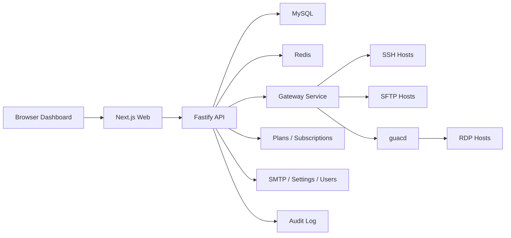

# Architecture

Onshell.cloud is split into separate services so browser UI, API business logic, gateway sessions, data storage, cache, and RDP streaming can scale independently.

## Services

* `apps/web`: renders the public SaaS page, customer console, admin panel, host list, terminal/RDP surfaces, snippets, and audit views.
* `apps/api`: owns authentication, organizations, RBAC, hosts, credential metadata, session records, snippets, public packages, checkout contracts, subscriptions, SMTP settings, platform settings, users, and audit events.
* `apps/gateway`: owns protocol sessions and performs server-side SSH, SFTP, tunnel, and RDP connection work, and terminates the tunnels held open by customer agents.
* `apps/agent`: runs on a *customer's own machine* and dials out to the gateway, so a browser can open that machine's shell. See [agent.md](agent.md).
* MySQL: durable system of record.
* Redis: session coordination, rate limits, queue state, and gateway coordination.
* guacd: RDP protocol bridge.

## Session Flow

1. User selects a host in the web dashboard.
2. Web calls `POST /sessions` on the API.
3. API validates RBAC, host access, and credential attachment.
4. API creates a session record and asks the gateway to open a protocol session.
5. Gateway returns a temporary connection URL or WebSocket path.
6. API writes audit events for session start, close, and failures.

## Browser Port Forwarding Constraint

Browsers cannot open arbitrary local TCP ports. Onshell.cloud should implement first-party forwarding as backend-side SSH tunnels exposed through short-lived, access-controlled web proxy URLs. Desktop-style local port forwarding belongs to the agent (`apps/agent`), which is the only component running on the user's own machine.
