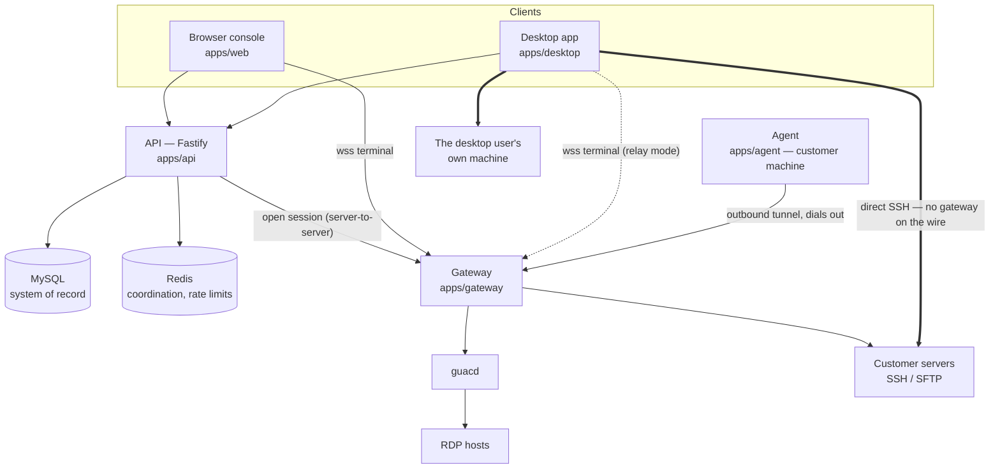
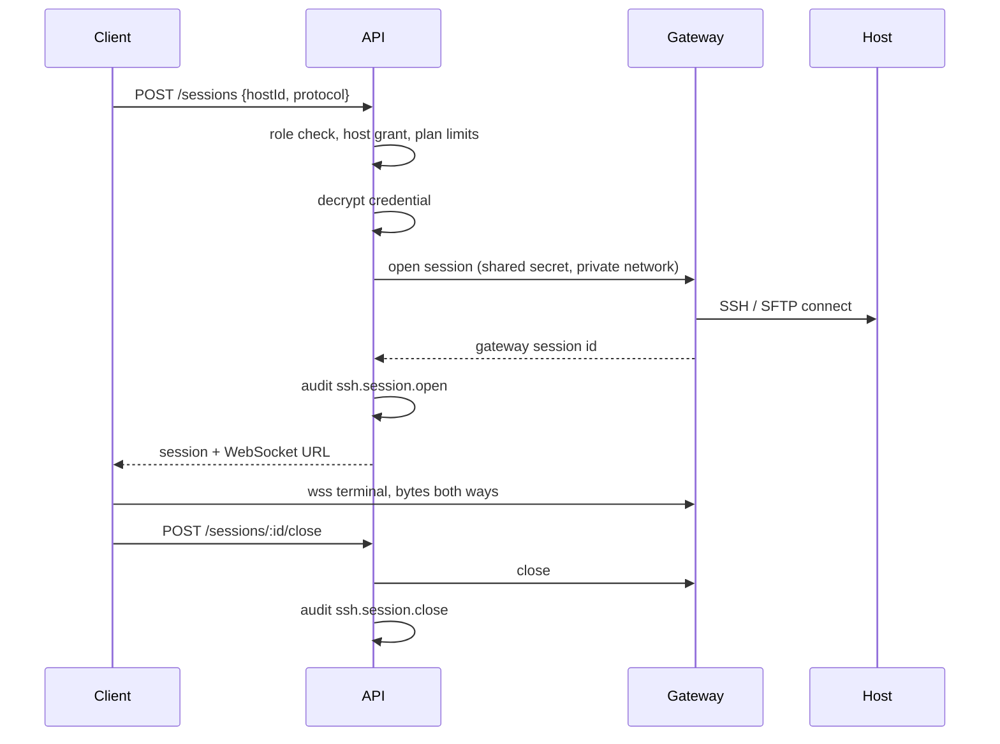
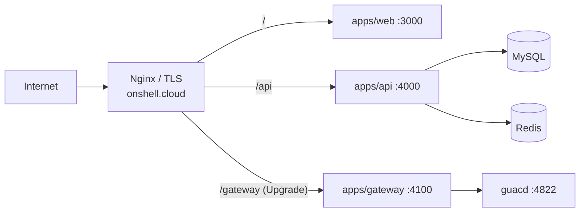

# Architecture

Onshell.cloud gives a team one place to reach their servers — from a browser tab, from
a desktop app, or from a machine they installed an agent on. This document is the map:
what each piece is, what it is trusted with, and what it deliberately cannot do.

It is written for someone who does not work here. The repository is public precisely
so that the claims below can be checked against the code, and every section names the
files that implement it.

## The shape of it

Thick arrows are the paths where Onshell's servers are **not** in the data path. Those
exist only in the desktop app, and they are the reason it exists.

## Services

| Service | Owns | Trusted with |
| --- | --- | --- |
| `apps/web` | marketing site, customer console, admin panel | nothing secret — it is a client |
| `apps/api` | auth, RBAC, orgs, hosts, the credential vault, sessions, billing, audit | the master encryption key and the database |
| `apps/gateway` | protocol sessions: SSH, SFTP, RDP via guacd, agent tunnels | credentials for the life of a relayed session |
| `apps/desktop` | native client: local shell, direct SSH, relay fallback, agent mode | leased credentials, in memory, on the user's own machine |
| `apps/agent` | headless CLI that shares one machine's shell and files | its own device token, nothing about other machines |
| MySQL | durable system of record | the ciphertext of every saved credential |
| Redis | session coordination, rate-limit counters | nothing durable |
| guacd | RDP protocol translation | RDP credentials for the life of a session |

The split is not decorative. The API is the only service that knows who you are; the
gateway is the only service that speaks SSH; neither can do the other's job, so
compromising one does not hand over the other's authority.

## What holds the secrets

This is the part worth reading closely.

**At rest.** Saved credentials are sealed with AES-256-GCM before they touch the
database — `encryptSecret` in [lib/encryption.ts](../apps/api/src/lib/encryption.ts).
The key comes from `MASTER_ENCRYPTION_KEY`, which lives in the environment, never in
the repository. The API refuses to boot in production while that variable still holds
its `.env.example` placeholder ([packages/config](../packages/config/src/index.ts)).
A database dump on its own is ciphertext.

**Never on the way back out.** No route returns a stored secret to a client. The
console sees credential *metadata* — label, kind, username, when it was last used —
and the API's create and update handlers accept a secret but never echo one
([routes/modules/credentials.ts](../apps/api/src/routes/modules/credentials.ts)).

**At use.** Something has to hold the plaintext to open an SSH connection. Which
component that is depends on the path:

| Path | Who decrypts | Who holds plaintext | For how long |
| --- | --- | --- | --- |
| Browser → relay | API, at `POST /sessions` | gateway process memory | the session |
| Desktop → relay | API, at `POST /sessions` | gateway process memory | the session |
| Desktop → direct | API, at lease issue | desktop main-process memory | the session, then zeroed |
| Desktop → this computer | nobody | nobody — there is no credential | — |
| Agent host | nobody | nobody — the tunnel is already authenticated | — |

The first two are the honest cost of a browser SSH client: a browser cannot speak SSH,
so a server must, and that server sees the credential. Saying otherwise would be a lie,
and products in this category that imply otherwise are usually relying on you not
reading closely. The desktop app's remaining two paths are how you avoid paying that
cost at all.

**Passwords.** User account passwords are a different thing from host credentials and
are hashed, never encrypted — there is nothing to reverse.

## Access control

Every request that touches a resource is checked twice: once for the organisation, once
for the specific host.

* **Organisation scoping.** Queries filter on `organizationId` from the caller's token,
  not from anything the caller sent.
* **Role.** Owner, admin, and member roles gate what can be created, opened, or
  revoked ([packages/shared](../packages/shared/src/index.ts)).
* **Per-host grants.** A member can be limited to named hosts or given the whole
  workspace, via `accessibleHostFilter` in
  [lib/host-access.ts](../apps/api/src/lib/host-access.ts). The filter is applied at
  the database query, so an unauthorised host id returns "not found" rather than being
  filtered out after the fact.
* **Re-checked at session open.** Listing a host and opening a shell on it are separate
  authorisations. Hiding a row is not the same as refusing it, and host ids are
  guessable enough that the difference matters.

**The gateway performs none of these checks and is not meant to.** It has no users, no
organisations, and no database; it does what it is asked. That is why it belongs on a
private network behind `GATEWAY_SHARED_SECRET`, and why the browser never calls its
REST API directly — every file operation is proxied through the API so the caller's
grants are re-applied ([routes/modules/sessions.ts](../apps/api/src/routes/modules/sessions.ts)).
A deployment that exposes the gateway to the internet without that secret has removed
the access control, and the deployment guide says so in those words.

## Sessions

Sessions are bound to a user, an organisation, a host, and a protocol. Open, close,
failure, and timeout are all audit events, as is every file operation and every
credential change. The audit log is per-organisation and readable by the workspace
itself, not only by the operator — a log the subject cannot read is a log they cannot
check.

## Reaching machines that have no SSH server

Two mechanisms, for two different situations.

**The agent** ([docs/agent.md](agent.md)) runs on a machine the workspace wants to
share and dials *out* to the gateway, so there is no inbound port and NAT is not a
problem. The gateway terminates that tunnel and exposes the machine as a host with
`transport: "agent"`. The machine's owner controls it: pairing is explicit, the tray
icon is always visible while it runs, `allowShell` and `allowFiles` are per-device,
sessions can require consent at the machine, a local audit journal records everything,
and revocation from the console drops the tunnel.

**The desktop app's local mode** ([docs/desktop.md](desktop.md)) covers the case where
the machine you want a shell on is the machine you are sitting at. No tunnel, no
gateway, no network — `node-pty` in the app's own process.

The built-in `transport: "local"` host is a third thing entirely and easy to confuse
with these: it is a shell on the *gateway's* machine, provisioned for every workspace
([lib/provisioning.ts](../apps/api/src/lib/provisioning.ts)), and it is gated by
deployment policy.

## Sessions, tokens, and staying signed in

Access tokens are short-lived JWTs (12 hours) signed with `JWT_SECRET`; the refresh
token in an httpOnly cookie is what makes a session last a month, and it rotates on
every use ([lib/token.ts](../apps/api/src/lib/token.ts),
[lib/refresh-tokens.ts](../apps/api/src/lib/refresh-tokens.ts)). The short access-token
lifetime is the bound on revocation: nothing can withdraw a signed token before it
expires, so a revoked device keeps working for at most that long.

Cookie attributes are derived from the connection they are set on rather than from
configuration ([lib/session-cookie.ts](../apps/api/src/lib/session-cookie.ts)), because
both `Secure` and `Domain` fail *silently* when they do not match the browser's
reality — and a silently dropped session cookie presents to the user as "wrong
password".

The desktop app uses bearer tokens instead of cookies, with the refresh token in the OS
keychain via Electron's `safeStorage`.

### Which workspace a session is in

An account can belong to several organizations, and one of them is active for the session.
That choice lives on the session row (`RefreshToken.organizationId`) rather than only in the
access token, because both clients call `/auth/refresh` on any 401 and on tab focus — a
choice held only in the token would be reset by a background refresh, moving the user into
another workspace with nothing on screen to explain it. It is also recorded on the account
(`User.lastActiveOrganizationId`), so signing in again lands where they left off.

Neither column is an authorization. Every request re-loads the memberships and re-derives the
role from the one that resolves ([lib/current-user.ts](../apps/api/src/lib/current-user.ts),
[lib/active-organization.ts](../apps/api/src/lib/active-organization.ts)), so the token's
`organizationId` and `role` claims are read as a request and never as a fact. That is what
makes removing a member effective on their very next call instead of at token expiry, and
what stops a workspace switch from widening the reach of an older, still-valid token. Where a
session names a workspace the person is no longer in, it falls back to one they are — and
reports the substitution, because a host list that silently becomes another workspace's is
indistinguishable from a broken console.

The fallback is the oldest membership, which is a decision rather than an accident: it used
to be `memberships[0]` from an unordered load, which resolved through the userId index in
primary-key order and so was *always* the oldest — pinning anyone who accepted an invitation
to a second workspace inside their first one permanently.

## Deployment

One host serves everything in production: Nginx routes `/api` to the API and `/gateway`
to the gateway. Because it is a single origin, the session cookie is first-party and no
cross-site request needs reasoning about. The gateway's own port is not published.
Details in [deploy-cloudpanel.md](deploy-cloudpanel.md).

## Known constraints

**Browsers cannot open local ports.** So browser-side port forwarding is not
implementable as such; first-party forwarding has to be a backend SSH tunnel behind a
short-lived, access-controlled URL. Real local forwarding belongs to the components
that run on the user's machine — the agent and the desktop app.

**A relay sees the credential.** Restated because it is the most important sentence in
this document. If that is unacceptable for your threat model, the answers are the
desktop app's direct mode, or self-hosting, or both.

**The operator can decrypt the vault.** Whoever holds `MASTER_ENCRYPTION_KEY` and the
database can read saved credentials. That is inherent to a service that opens
connections for you. Self-hosting moves "the operator" to being you.

## Related documents

* [desktop.md](desktop.md) — the desktop app: local shell, direct SSH, credential leases
* [agent.md](agent.md) — the agent protocol, pairing, and consent model
* [security.md](security.md) — the security requirements this implementation is held to
* [../SECURITY.md](../SECURITY.md) — how to report a vulnerability, and the deliberate trust boundaries
* [deploy-cloudpanel.md](deploy-cloudpanel.md) — production deployment
