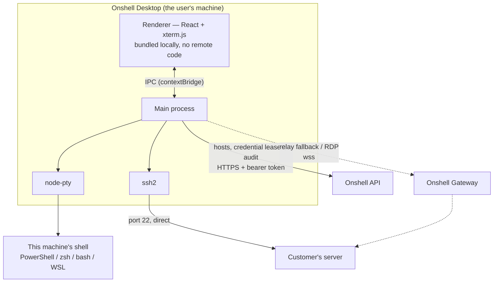
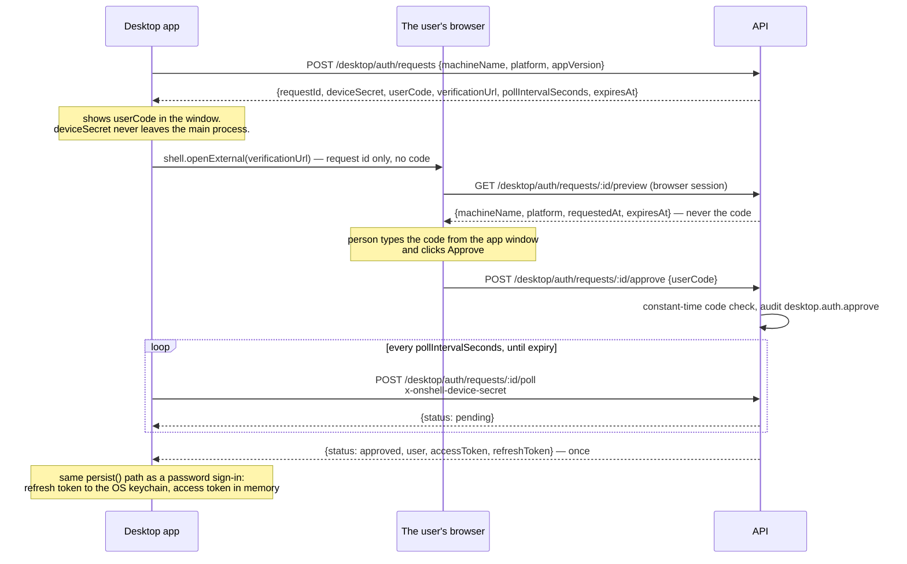
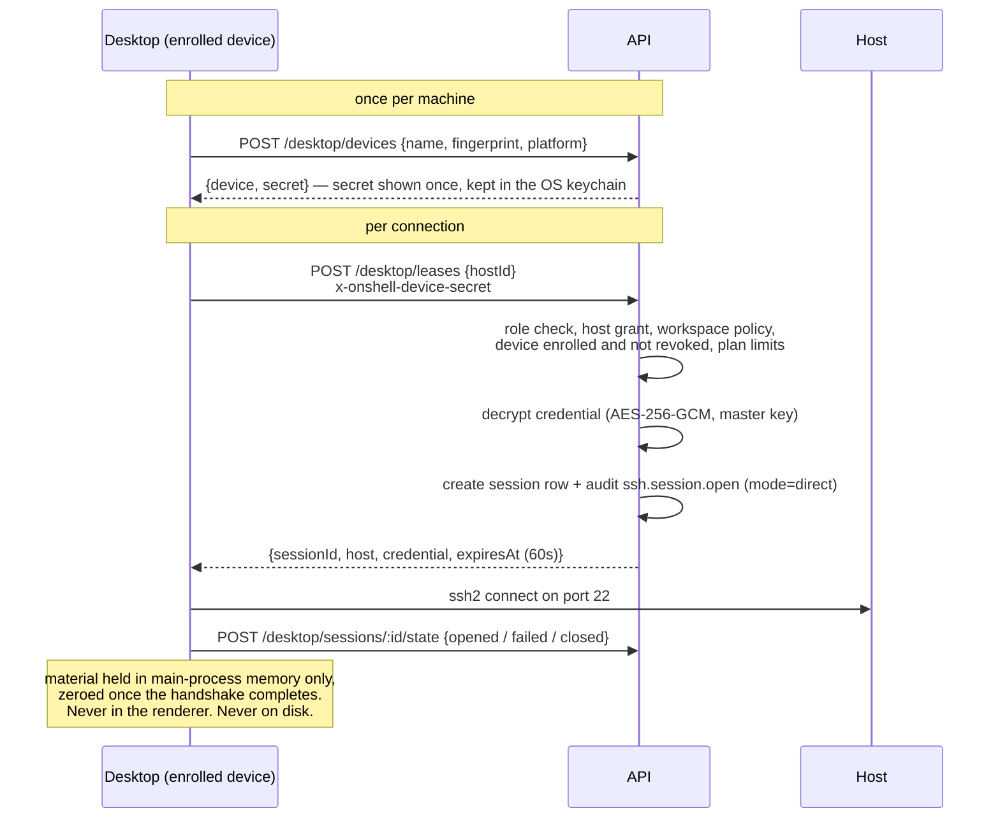

# Onshell Desktop

`apps/desktop` — the Onshell console as a native application, for people who want
their own machine's terminal in the same window as their servers, and who would
rather their SSH traffic went straight to the host instead of through anyone's cloud.

It is one installer with three ways of reaching a shell, and the person using it
picks. That choice is the whole product.

## Why a desktop app exists

The browser console is good at what a browser can do. Two things it structurally
cannot do, and never will:

**It cannot open a shell on the machine it is running on.** A tab has no API for
spawning a process, and that is the sandbox boundary the web rests on, not an
oversight. Someone who wants their laptop's PowerShell next to their production box
has to run *something* locally. Today that something is `apps/agent`, and it reaches
the laptop the long way round — out to the gateway, back down the tunnel, into the
browser. It works, and it is absurd when the browser and the laptop are the same
machine.

**It cannot open a TCP connection to port 22.** A browser speaks HTTP and WebSocket,
so every browser SSH product on earth relays through a server that speaks SSH on the
user's behalf. That server necessarily holds the credential in memory for the life of
the session. It is an honest trade for a browser. It is an unnecessary one for a
native app, which can simply dial the host itself.

So the desktop app is not a wrapper around the website. It removes the relay from the
paths that never needed it.

## The three paths



### 1. This computer — local

`node-pty` in the main process, shell discovery shared with `@onshell/agent`. Opening
it involves no network at all: not the API, not the gateway, not the internet. Pull
the ethernet cable and the tab keeps working.

This is the path that made the desktop app worth building. The same shells the agent
exposes — PowerShell, cmd, WSL distributions, zsh, bash — served to a terminal on the
same machine, with nothing in between.

### 2. Direct — the desktop dials the host

`ssh2` in the main process opens the TCP connection to the host itself. The traffic
goes from the user's machine to their server. Onshell's gateway is not on the wire and
cannot be: it has no socket in this path.

What the server still does is decide *whether* the connection may happen, and record
that it did. Access control and audit stay central — that is what makes this a team
product rather than a bag of `.ssh/config` files — while the bytes stay private. The
credential arrives by lease (below).

This is also what makes hosts on a private network work. A box reachable from the
user's laptop but not from the public internet is unreachable to a browser console
and ordinary to this one.

### 3. Relay — through the gateway, exactly like the browser

The existing path: `POST /sessions`, then a WebSocket to the gateway, which holds the
SSH connection. The desktop uses it when

* the host is only reachable from the gateway's network, not the user's,
* direct connection fails (firewall, missing route) and the user accepts the fallback,
* the protocol is RDP, which needs guacd,
* the host is an **agent host** — someone else's machine, reached down its tunnel,
* or the workspace's policy says direct connections are not allowed.

Fallback is offered, never silent. A session that quietly stopped being end-to-end
would make the promise above worthless, so the terminal says which path it is on, and
switching paths is a thing the user does, not a thing that happens to them.

## Signing in

A native window can offer a password and nothing else. It cannot run Google's SSO
redirect, it cannot render a Turnstile widget, and it knows nothing about the session
the user's browser is very probably already holding. So for a growing share of accounts
the password form was not a worse option, it was an impossible one: an account created
with Google has no `passwordHash`, `POST /auth/login` returns `invalid_credentials` for
it unconditionally, and no password the person could type would ever have worked.

So the app offers two ways in, and the browser is the one it leads with.

### Sign in with browser

An OAuth-device-authorization-shaped flow: the app asks the server for a pending
sign-in, opens the user's real browser at it, shows a code, and waits to be told a
signed-in human approved it.



Rules the implementation has to keep:

| Rule | Why |
| --- | --- |
| The **user code is typed into the browser**, never carried in the URL | It is the only thing tying the approval to the machine that asked. A pre-filled code makes approval one click on a page that looks entirely legitimate — which is the phishing attack this flow shape invites |
| The page **never returns the code**, only what the client claimed about itself | Otherwise the id alone would be enough to complete somebody else's sign-in |
| Both secrets are stored **hashed** and compared in **constant time** | A heap read, a log line, or a timing loop must not be a way in |
| **One shot**: the poll that collects the tokens consumes the request | A second poll gets `expired`. An approved request that stayed collectable would make the device secret pointless |
| **Five minutes**, a five-attempt code cap, and a poll cap | Long enough to walk the code across, too short to leave lying around |
| Approval **mints for the approver's own account** | `userId` comes from the approver's access token; no field in the request can name anyone else |
| Approval and denial are **audited**, and the sign-in lands in the **login log** | `desktop.auth.approve` / `desktop.auth.deny`, plus an auth event when the session is actually issued |
| Pending requests live in **memory**, not a table | They are worthless after five minutes. Surviving an API restart would buy nothing and leave a table of half-finished sign-ins to age out |

The state machine and the reasoning behind each of those live in
[lib/desktop-auth.ts](../apps/api/src/lib/desktop-auth.ts); the routes are the thin
edge of it in [routes/modules/desktop.ts](../apps/api/src/routes/modules/desktop.ts),
and the browser side is [/desktop/authorize](../apps/web/src/app/desktop/authorize/page.tsx).

The device secret and the token pair never cross the IPC bridge. The renderer is handed
the code to display and a promise that resolves to "you are signed in" — same boundary
as everything else in this app.

### Password sign-in

Still there, as the alternative, and now it explains itself. Every code either auth leg
can return is mapped to a sentence: a rejected password, a per-account lockout with its
countdown, a bot-protection challenge this window cannot render (which says to use the
browser instead), a 404 that means the server address is wrong rather than the password,
a proxy answering with HTML instead of JSON, and a DNS or connection failure — which
used to throw inside the IPC handler and leave the button spinning on "Signing in…"
with no message at all.

A raw `invalid_credentials` is never shown to a person. That failure also carries the
Google hint, because the API cannot distinguish "wrong password" from "this account has
no password" without becoming an account-enumeration oracle for anyone with a word
list — so the app says both possibilities in the one message it already shows, to
everybody, which reveals nothing about any particular address.

## Credential leases

Direct mode needs the credential on the user's machine. That is a real widening of
where secrets go, and it is bounded deliberately.



Note the order of the checks, because it is the argument: nothing is read out of
the vault until every reason to refuse has been exhausted. See
[routes/modules/desktop.ts](../apps/api/src/routes/modules/desktop.ts).

Rules the implementation has to keep:

| Rule | Why |
| --- | --- |
| A lease is for **one host, one session**, and expires in ~60 seconds | It is a launch token, not a copy of the vault |
| It is only issued to a **device enrolled by that user**, not revoked | Makes the handout visible per machine, and revocable one machine at a time |
| It requires the same **host grant** as opening a relayed session | Direct mode must not be a way around RBAC |
| The material lives in the **main process only** | The renderer runs UI code; it never gets to hold a private key |
| It is **never written to disk**, and is zeroed on close | Survives neither a crash dump nor a stolen laptop at rest |
| Every issue is **audited** with the device id | An operator can see which machine asked for what |
| An org can **turn direct mode off** | Some teams need every byte through an auditable relay |

Being enrolled is not what *authorises* a lease — the signed-in user's own host access
is — so it is worth being plain that enrolment does not stop someone who has already
stolen a session: they could enrol a machine of their own. What it buys is that every
handout is attributable to a named machine and can be cut off one machine at a time,
which is the difference between noticing a compromise and being able to do anything
about it.

The honest summary: direct mode gives the user's own machine material for a host that
user could already open a shell on. It does not grant new access. It changes who is on
the wire, and it moves a copy of the secret from Onshell's server to the user's
computer — which is exactly what people asking for this feature are asking for.

## Security boundaries inside the app

**The renderer never loads remote code.** The UI is built at package time and served
from the app bundle. Not the website in a frame, not a remote URL. A compromise of
onshell.cloud must not become code execution on every installed desktop, and the only
way to guarantee that is for the server to never be a source of executable code.

**`contextIsolation: true`, `nodeIntegration: false`, `sandbox: true`.** The renderer
gets a typed `window.onshell` surface from the preload and nothing else — no `require`,
no `child_process`, no arbitrary path reads.

**The IPC surface is narrow and named.** Every channel is a specific verb
(`terminal.openLocal`, `ssh.connect`, `files.list`) with validated arguments. There is
no "run this command" channel and no "read this file" channel taking an unconstrained
path. The preload is the security review surface for this app; it is kept small enough
to read in one sitting.

**Tokens live in the OS keychain.** The refresh token goes through Electron's
`safeStorage` — Keychain on macOS, DPAPI on Windows, libsecret on Linux — not a JSON
file next to the config. Access tokens stay in memory.

**There is no auto-updater yet, and that is deliberate.** An updater downloads code and
runs it as you, which is only acceptable when the payload's signature can be checked —
and these builds are not code-signed yet. Shipping the download half before the
verification half is how a release channel becomes an attack channel. So the app checks
whether a newer version exists, says so, and opens the release page; installing is the
user's action. `src/main/runtime/updates.ts` is where an electron-updater feed goes once
the certificates are in place.

The workflow that produces the artifacts is in this repository either way. An installer
is a thing you run as yourself, and the only honest answer to "what is in it" is a build
recipe anyone can read: [.github/workflows/desktop.yml](../.github/workflows/desktop.yml).

## Relationship to the agent

`apps/agent` (the headless CLI) and this app now serve different people:

| | `apps/agent` | `apps/desktop` |
| --- | --- | --- |
| Runs on | servers, unattended machines | a person's own computer |
| Interface | terminal, service manager | window and tray |
| Purpose | *share* this machine with the workspace | *use* the workspace, and optionally share this machine |
| Consent | config file, local audit journal | tray presence, prompts, local audit journal |

The desktop app absorbs the agent's tunnel as a mode — "Share this computer" — so one
installer covers both directions: your laptop can reach your servers, and your laptop
can be reached from a browser elsewhere. `apps/agent-desktop`, the tray-only wrapper
around the agent, has been retired into this app.

Pairing is a click rather than a typed code, because the person is already signed in:
the app mints a pairing code through the API and spends it immediately. The code exists
to carry authority from a browser into a program that has none, and here the program
already has it.

The agent core keeps its own configuration file, separate from the app's. That is
deliberate — a shared machine stays paired, and stays revocable by whoever is sitting at
it, whether or not anyone is signed in to the desktop app. Two relationships, two
lifetimes.

Sharing is off until switched on, and the tray icon stays visible while it is on. A
remote-access program you cannot see running is spyware; the visible presence, and the
fact that quitting stops every session, is the difference.

## Layout

```text
apps/desktop
├── src/main/            Node side — window, tray, IPC handlers
│   ├── index.ts            lifecycle, window, tray, every handler
│   └── runtime/
│       ├── settings.ts     server URL and preferences (never secrets)
│       ├── vault.ts        safeStorage-backed token store
│       ├── session.ts      the API client, password and browser sign-in
│       ├── device.ts       this machine's enrolment, secret in the keychain
│       ├── terminals.ts    local / direct / relay, and which one you got
│       ├── ssh.ts          direct ssh2 shell, and credential leases
│       ├── relay.ts        gateway WebSocket, same path as the browser
│       ├── files.ts        local fs, SFTP, and relayed file routes as one shape
│       └── sharing.ts      "share this computer" — the @onshell/agent tunnel
├── src/shared/ipc.ts    the contract — read this to know what the UI can ask for
├── src/preload/         the whole bridge, in one readable file
└── src/renderer/        React + xterm.js, bundled by Vite
```

`packages/api-client` holds the HTTP client both this app and the web console use, so
the two cannot drift on what an endpoint means.

## Self-hosting

The server URL is a setting, asked for on first run and changeable afterwards. A team
running their own Onshell points the same signed installer at their own deployment;
nothing about the binary is tied to `onshell.cloud`.

## Building it

```bash
yarn workspace @onshell/desktop dev     # Vite + Electron, against a local server
yarn workspace @onshell/desktop dist    # installers for this OS
```

`node-pty` and `cpu-features` are native modules. A local Windows package build
therefore needs Visual Studio 2022 Build Tools with the **Desktop development
with C++** workload. The release workflow uses the pinned `windows-2022` runner,
which already has that toolchain; do not disable Electron's native rebuild to
work around a missing compiler, because the resulting installer can package a
module for the wrong ABI and fail only when a terminal opens.

## Cutting a release

The version in `apps/desktop/package.json` is what ends up in the installer names
and in the app's own "Onshell Desktop x.y.z", so bump it first and let the tag
match:

```bash
git tag desktop-v0.3.3
git push origin desktop-v0.3.3
```

That runs [.github/workflows/desktop.yml](../.github/workflows/desktop.yml) on
macOS, Windows, and Linux runners, and publishes the six installers as a GitHub
Release on `onshell-downloads` — the public repository the download page already
links to. `DOWNLOADS_TOKEN` has to be set for that; without it the job fails
loudly rather than finishing green having published nothing.

A tagged release does not require Apple credentials. While Apple Developer
access is unavailable, it publishes ad-hoc-signed macOS installers and a
platform-specific SHA-256 manifest; users follow the documented Gatekeeper
one-time approval flow. The ad-hoc signature seals the full Electron bundle but
does not establish publisher trust or replace notarization. If `MAC_CSC_LINK`,
`MAC_CSC_KEY_PASSWORD`, `APPLE_ID`,
`APPLE_APP_SPECIFIC_PASSWORD`, and `APPLE_TEAM_ID` are all present, the same
job signs and notarizes the app and verifies both x64 and arm64 bundles with
`codesign` and `spctl`. A partial secret set falls back to ad-hoc-signed output
rather than producing a misleading half-signed release.

Numbering starts at 0.2.0 rather than 0.1.0: `desktop-v0.1.x` tags already exist
from the old agent-only tray app, and reusing a version for different software
would make "which build is this" unanswerable from the tag alone.

Running the workflow by hand (`workflow_dispatch`) builds all three legs and
uploads them as run artifacts without publishing anything, which is the way to
check a packaging change before committing to a version number.

Everything below is what that workflow does under the hood. That workflow is public for the same reason the rest of this is: an
installer with an updater is a remote code execution channel, and the only honest
answer to "what is in the binary you want me to run as myself" is a recipe anyone can
read.
