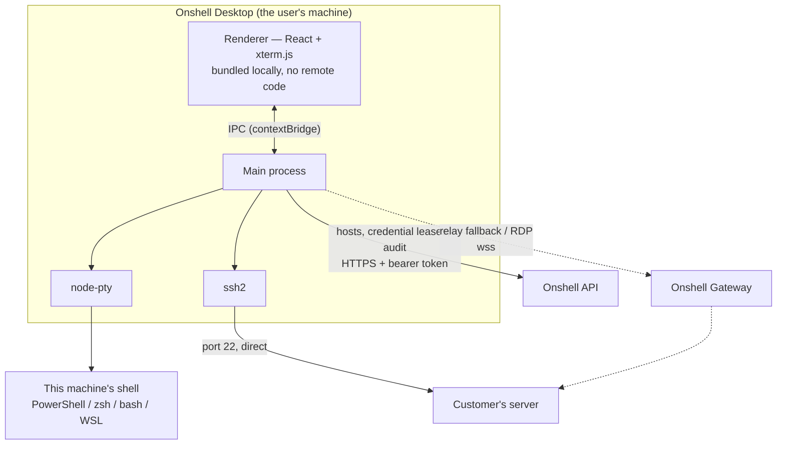
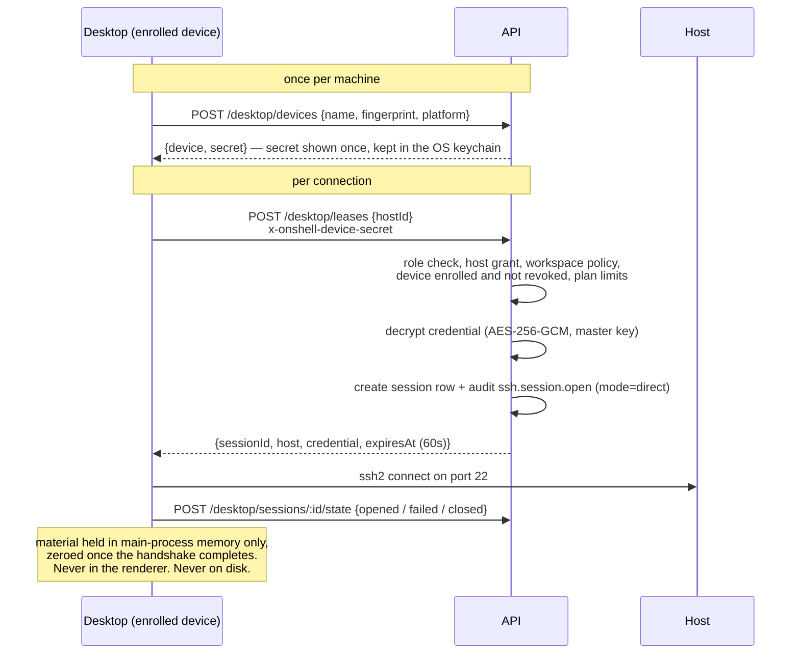

# Onshell Desktop

`apps/desktop` — the Onshell console as a native application, for people who want
their own machine's terminal in the same window as their servers, and who would
rather their SSH traffic went straight to the host instead of through anyone's cloud.

It is one installer with three ways of reaching a shell, and the person using it
picks. That choice is the whole product.

## Why a desktop app exists

The browser console is good at what a browser can do. Two things it structurally
cannot do, and never will:

**It cannot open a shell on the machine it is running on.** A tab has no API for
spawning a process, and that is the sandbox boundary the web rests on, not an
oversight. Someone who wants their laptop's PowerShell next to their production box
has to run *something* locally. Today that something is `apps/agent`, and it reaches
the laptop the long way round — out to the gateway, back down the tunnel, into the
browser. It works, and it is absurd when the browser and the laptop are the same
machine.

**It cannot open a TCP connection to port 22.** A browser speaks HTTP and WebSocket,
so every browser SSH product on earth relays through a server that speaks SSH on the
user's behalf. That server necessarily holds the credential in memory for the life of
the session. It is an honest trade for a browser. It is an unnecessary one for a
native app, which can simply dial the host itself.

So the desktop app is not a wrapper around the website. It removes the relay from the
paths that never needed it.

## The three paths



### 1. This computer — local

`node-pty` in the main process, shell discovery shared with `@onshell/agent`. Opening
it involves no network at all: not the API, not the gateway, not the internet. Pull
the ethernet cable and the tab keeps working.

This is the path that made the desktop app worth building. The same shells the agent
exposes — PowerShell, cmd, WSL distributions, zsh, bash — served to a terminal on the
same machine, with nothing in between.

### 2. Direct — the desktop dials the host

`ssh2` in the main process opens the TCP connection to the host itself. The traffic
goes from the user's machine to their server. Onshell's gateway is not on the wire and
cannot be: it has no socket in this path.

What the server still does is decide *whether* the connection may happen, and record
that it did. Access control and audit stay central — that is what makes this a team
product rather than a bag of `.ssh/config` files — while the bytes stay private. The
credential arrives by lease (below).

This is also what makes hosts on a private network work. A box reachable from the
user's laptop but not from the public internet is unreachable to a browser console
and ordinary to this one.

### 3. Relay — through the gateway, exactly like the browser

The existing path: `POST /sessions`, then a WebSocket to the gateway, which holds the
SSH connection. The desktop uses it when

* the host is only reachable from the gateway's network, not the user's,
* direct connection fails (firewall, missing route) and the user accepts the fallback,
* the protocol is RDP, which needs guacd,
* the host is an **agent host** — someone else's machine, reached down its tunnel,
* or the workspace's policy says direct connections are not allowed.

Fallback is offered, never silent. A session that quietly stopped being end-to-end
would make the promise above worthless, so the terminal says which path it is on, and
switching paths is a thing the user does, not a thing that happens to them.

## Credential leases

Direct mode needs the credential on the user's machine. That is a real widening of
where secrets go, and it is bounded deliberately.



Note the order of the checks, because it is the argument: nothing is read out of
the vault until every reason to refuse has been exhausted. See
[routes/modules/desktop.ts](../apps/api/src/routes/modules/desktop.ts).

Rules the implementation has to keep:

| Rule | Why |
| --- | --- |
| A lease is for **one host, one session**, and expires in ~60 seconds | It is a launch token, not a copy of the vault |
| It is only issued to a **device enrolled by that user**, not revoked | Makes the handout visible per machine, and revocable one machine at a time |
| It requires the same **host grant** as opening a relayed session | Direct mode must not be a way around RBAC |
| The material lives in the **main process only** | The renderer runs UI code; it never gets to hold a private key |
| It is **never written to disk**, and is zeroed on close | Survives neither a crash dump nor a stolen laptop at rest |
| Every issue is **audited** with the device id | An operator can see which machine asked for what |
| An org can **turn direct mode off** | Some teams need every byte through an auditable relay |

Being enrolled is not what *authorises* a lease — the signed-in user's own host access
is — so it is worth being plain that enrolment does not stop someone who has already
stolen a session: they could enrol a machine of their own. What it buys is that every
handout is attributable to a named machine and can be cut off one machine at a time,
which is the difference between noticing a compromise and being able to do anything
about it.

The honest summary: direct mode gives the user's own machine material for a host that
user could already open a shell on. It does not grant new access. It changes who is on
the wire, and it moves a copy of the secret from Onshell's server to the user's
computer — which is exactly what people asking for this feature are asking for.

## Security boundaries inside the app

**The renderer never loads remote code.** The UI is built at package time and served
from the app bundle. Not the website in a frame, not a remote URL. A compromise of
onshell.cloud must not become code execution on every installed desktop, and the only
way to guarantee that is for the server to never be a source of executable code.

**`contextIsolation: true`, `nodeIntegration: false`, `sandbox: true`.** The renderer
gets a typed `window.onshell` surface from the preload and nothing else — no `require`,
no `child_process`, no arbitrary path reads.

**The IPC surface is narrow and named.** Every channel is a specific verb
(`terminal.openLocal`, `ssh.connect`, `files.list`) with validated arguments. There is
no "run this command" channel and no "read this file" channel taking an unconstrained
path. The preload is the security review surface for this app; it is kept small enough
to read in one sitting.

**Tokens live in the OS keychain.** The refresh token goes through Electron's
`safeStorage` — Keychain on macOS, DPAPI on Windows, libsecret on Linux — not a JSON
file next to the config. Access tokens stay in memory.

**Updates are signed.** An auto-updater is a remote code execution channel by
construction. Windows and macOS builds are code-signed and notarised, the update feed
is served over HTTPS, and the release workflow that produces the artifacts is in this
repository where it can be read.

## Relationship to the agent

`apps/agent` (the headless CLI) and this app now serve different people:

| | `apps/agent` | `apps/desktop` |
| --- | --- | --- |
| Runs on | servers, unattended machines | a person's own computer |
| Interface | terminal, service manager | window and tray |
| Purpose | *share* this machine with the workspace | *use* the workspace, and optionally share this machine |
| Consent | config file, local audit journal | tray presence, prompts, local audit journal |

The desktop app absorbs the agent's tunnel as a mode — "Share this computer" — so one
installer covers both directions: your laptop can reach your servers, and your laptop
can be reached from a browser elsewhere. `apps/agent-desktop`, which was the tray-only
wrapper around the agent, is retired into this app.

Sharing is off until switched on, and the tray icon stays visible while it is on. A
remote-access program you cannot see running is spyware; the visible presence, and the
fact that quitting stops every session, is the difference.

## Layout

```text
apps/desktop
├── src/main/            Node side — windows, tray, IPC handlers, updater
│   ├── runtime/
│   │   ├── local-pty.ts    "this computer" shells
│   │   ├── ssh.ts          direct ssh2 shell + sftp
│   │   ├── relay.ts        gateway WebSocket fallback
│   │   ├── lease.ts        credential leases, memory-only, zeroed on close
│   │   ├── vault.ts        safeStorage-backed token store
│   │   └── audit.ts        local journal + best-effort upload
│   └── agent/           "share this computer" — @onshell/agent tunnel
├── src/preload/         the whole IPC surface, in one readable file
└── src/renderer/        React + xterm.js, bundled by Vite
```

`packages/api-client` holds the HTTP client both this app and the web console use, so
the two cannot drift on what an endpoint means.

## Self-hosting

The server URL is a setting, asked for on first run and changeable afterwards. A team
running their own Onshell points the same signed installer at their own deployment;
nothing about the binary is tied to `onshell.cloud`.

## Status

Being built in phases; [rollout.md](rollout.md) tracks what has shipped.
